## QuecPython支持群地址

移远QuecPython开发交流群：445121768

## QuecPython相关准备

### 开发板

目前推荐的开发板：

（1）小熊派

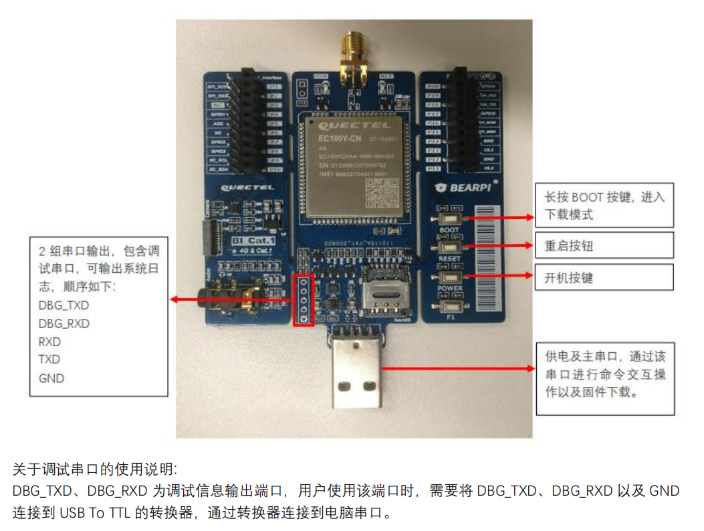

（2）EC600S_QuecPython_EVB_V1.x 开发板

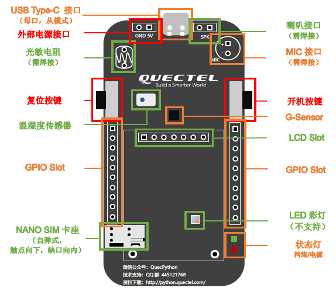

### 驱动下载安装

1.使用开发板前，需要在电脑上安装USB驱动。正确安装后，电脑可以识别开发板。

| 驱动程序名称     | Quectel_ASR_Series_UMTS&LTE_Windows_USB_Driver_Customer      |
| ---------------- | ------------------------------------------------------------ |
| 驱动程序下载地址 | [https://python.quectel.com/download.html](https://python.quectel.com/download.html) |

2.开发者下载驱动程序的压缩包后，完整解压该压缩包到任意目录，双击运行setup.exe： 

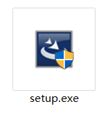

3.按照提示，点击Install即可：


4.安装成功后，点击“Finish”结束：


5.至此，USB 驱动安装结束。

6.对于python固件的模块，驱动安装好的设备管理器是：


​    对于非python固件的模块，驱动安装好的设备管理器是：


 

**TIPS**

（1）“QuecPython驱动安装失败问题”见“QuecPython驱动安装失败问题解决”章节

（2）安装前，请备份您的重要文件，并保存您的工作进度，以免发生意外情况，导致文件丢失

（3）安装成功后，无需重启电脑

（4）如需修复或者卸载驱动程序，再次运行该驱动安装程序，选择“修复”或“卸载” 即可


### 固件下载安装

**说明：**
（1）为了对客户python应用程序做交互适配，需要先下载QuecPython固件到开发板中，下载完成后才可以对python应用程序做底层适配处理。固件下载网址：[https://python.quectel.com/download.html](https://python.quectel.com/download.html)
（2）QPYcom工具支持烧py固件，不支持烧C固件
（3）具体步骤如下

1.首先确认自己的模块版本，使用QCOM查看，发送AT指令 ‘AT+GMR ‘，如下所示：


版本说明：如果是python版的固件（固件号以PY结尾），则直接跳过此步骤；如果不是python版本，根据版本的前半部分，下载对应的固件（如果是下图的固件，请至官网下载对应的EC600SCNAA的python固件）


2.不要打开串口，直接创建项目（**对于非python固件模块，不要打开任何串口，包括AT串口**）。


3.点击“选择固件”。


**注意事项：**
（1）	选择的固件是一个压缩包
（2）	固件的下一级目录全部是.bin等等，也就是说固件里面无额外的压缩包。（可能存在官网下载的固件需要解压再进行下一步）

4.点击“下载固件”


5.等待20秒左右会出现下载进度条


6.等待下载结束出现下方界面表示“下载成功”


TIPS：
（1）“QuecPython固件安装失败问题”见“QuecPython救砖处理”章节
（2）安装前，请备份您的重要文件，并保存您的工作进度，以免发生意外情况，导致文件丢失
（3）安装成功后，无需重启电脑

### 脚本下载

​		脚本下载的建议：

（1）为了方便脚本下载，QPYcom已经做了脚本拖拽下载的功能，欢迎大家使用，如您有使用问题，可参考《Quectel QuecPython_QPYcom工具使用说明》

（2）如果你想一次性下载您的所有脚本，并清除原来的脚本（具体清除哪些脚本，见下面解释），可以按照下面的脚本下载步骤操作

​		对于使用如下脚本下载的步骤，哪些脚本会被删除的解释：对于根目录除了json都会删除，而对于子文件夹（自己新建一个文件夹），脚本下载不会影响这个文件夹。

1.用户选择“USB串行设备”后，“打开串口”，点击“下载”按钮，创建项目（项目名称随意）。        


2.点击“选择固件”（脚本下载暂时是需要选择固件，但是不会下载固件，这一步后面可以省略）。


3.选择需要下载的脚本


4.下载脚本，等待完成


5.完成界面展示


## QuecPython驱动安装失败问题解决

如遇安装好了驱动，但是出现USB枚举失败，解决方式是：

（１）  确保是官网下载最新的对应的驱动（win7和win10是不同的）

（２）  在“控制面板”——“卸载程序”中，查看驱动是否安装成功，截图是显示安装成功的

 

（３）  如果仍存在驱动安装问题，请加入我们的QQ 群 445121768，工程师在线为您答疑解惑


## QuecPython救砖处理

当使用QPYcom工具下载固件失败后，不用担心板子成砖，我们来帮你救砖。

### 方法1

1.打开电脑任务管理器（可快捷键“Ctrl+Alt+Delete”打开），找到QPYcom.exe，强制结束后台任务。

2.对于开发板：按住板子上的reset按键，重启板子；对于裸模块，可直接断电再上电，然后拉低POWKEY开机

3.看设备管理器的串口列表中是否显示出正常数目的串口，如果原固件是python固件，会正常显示三个串口（AT、DIAG以及USB串行设备口），如下表格左侧截图，如果原固件是非python固件，会正常显示两个串口（AT和DIAG口），如下表格右侧截图。以下的截图都属于正常显示，对于可正常显示的模组，请进行第4步；对于非正常显示的模组，则参考方法2或者方法3。

| python固件模组对应的设备管理器  | 非python固件模组对应的设备管理器 |
| ------------------------------- | -------------------------------- |
|  |   |

4.如果正常显示出串口则重新打开QPYcom.exe工具，参照《Quectel QuecPython_QPYcom工具使用说明》重新下载固件。

 

### 方法2

如果在QPYcom里面升级失败或者升级过程中断开连接，请按照如下步骤执行：

1.模组断电，短接VDD_EXT 和USB_BOOT，模组对应的PIN脚位置如下图

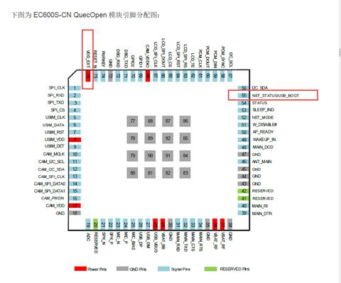

或者可以是直接短接EC600S_QuecPython_EVB_V1.x 开发板的BOOT和1V8（如下图）；对于其他开发板，自己找到对应的位置


2.查看设备管理是否会出现DOWNLOAD口，如下图所示：


3.如果不是上图所示的下载口，出现ASR下载口，如下图所示：


​		有两种解决方案：

（1）忽略，继续执行下面“步骤4”，但是如果失败，则按照方法3操作

（2）调整下载口（具体步骤见章节“下载口调整”）

4.打开QPYcom，不要打开串口，直接创建项目（**对于非python固件的模块，一定不要打开串口**）。


5.点击“选择固件”。

**注意事项：**

（1）选择的固件是一个压缩包

（2）固件的下一级目录全部是.bin等等，也就是说固件里面无额外的压缩包。（可能存在官网下载的固件需要解压再进行下一步）


6.点击“下载固件”


7.等待20秒左右会出现下载进度条


8.等待下载结束出现下方界面表示“下载成功”


 

9.对于上面下载成功后会自动重启模组（若未重启，手动重启即可），检查设备管理器，正确显示如下：


 

### 方法3

 

1.下载 QFlash 工具压缩包，解压后，双击运行该软件；


2.点击【Load FW Files】 选择固件升级包。

**固件包注意事项：**

（1）选择的固件是一个压缩包

（2）固件的下一级目录全部是.bin文件等等，也就是说固件里面无额外的压缩包。（可能存在官网下载的固件需要解压再进行下一步）

3.对于EC100Y和EC600S都无需选择COM port 和 Baudrate，所以对于图中的“COM port和Baudrate”可忽略，也就是说，即使没有正常端口，也可以使用Qflash来固件下载

4.短接VDD_EXT和USB_BOOT（上电前短接，短接位置见方法2），然后上电，同时点击Qflash的start。

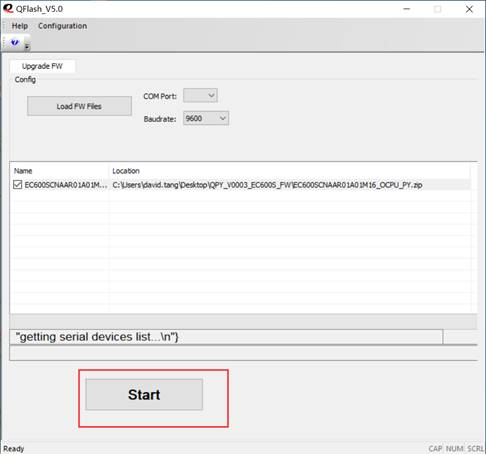

注意事项：

​		由于Qflash检测下载口有时间限制，可以考虑把短接放在第一步，然后对于第4步，直接上电即可；或者对于第4步的短接上电需要快速操作

5.下载结束，参考如下截图：

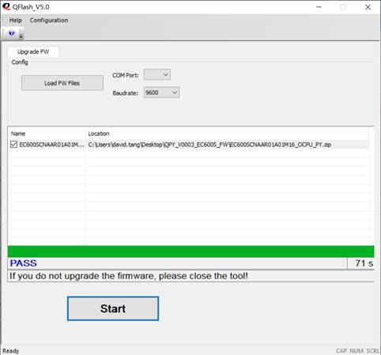

6.QCOM查询如下图

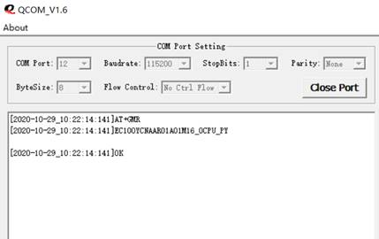

显示py结尾表示烧录py固件成功

对于方法2中可能遇到的问题有以下几点建议：

（1）如遇Qflash下载任何失败的问题，请关闭Qflash重新启动（如何有效的关闭Qflash进程，可以通过“Ctrl+Alt+Delete”打开“设备管理器”，彻底杀死Qflash，具体如下截图）。然后重新回到第一步进行固件下载操作。


（2）短接上电后计算机端口会显示如下图（禁用其他端口，出现下载口），可查看确认。


 

 


### 下载口调整

1.首先确认，下载口是否如下截图，如果是，继续执行“第2步”，否则的话，可群里（移远QuecPython开发交流群：445121768）咨询


2.选中上述截图的下载口，右击“更新驱动程序”


3. 选择“浏览我的电脑以查找驱动程序”


4.选择“让我从计算机上的可用驱动程序列表中选取”


 

5.选择“Quectel Download Port”（如果没有，请先下载安装驱动）后，点击“下一步”


6.选择“关闭”


7.最后界面如下图，表示“下载口调整”完成。


## QuecPython测试问题

### QuecPython main.py文件使用

对于main.py的几点建议：

（1）对于开始的调试，建议不要将程序命名为：main.py，建议使用其他名字，例如：start.py等等。如果里面存在死循环，那么在程序运行时无法中断，对于此情况，暂时只能通过重刷固件解决。

（2）如果真的想使用main.py程序，同时又需要使用死循环，记得在死循环里面加一个可中断的条件，例如（1.如下的例子是在一个线程里面加入了死循环，同时在这个死循环里面加入了中断退出的条件，当一直输出时，可通过GPIO2对应的按键中断输出；2.下面的例子是基于EC600S_QuecPython_EVB_V1.x 开发板的，其他开发板请自行配置按键中断）：

```python
import log
import _thread
from machine import Pin
import utime
log.basicConfig(level=log.NOTSET)
KEY_log = log.getLogger("KEY")
gpio2 = Pin(Pin.GPIO2, Pin.IN, Pin.PULL_DISABLE, 0)
def in_capture():
    KEY_log.debug("in_capture start!")
    while True:
        KEY_log.info("1111")
        utime.sleep(1)
        if gpio2.read() == 0:
            KEY_log.info("in_capture thread end")
            break
        else:
            pass
if __name__ == "__main__":
    _thread.start_new_thread(in_capture, ())

```

（3）对于自运行没有log输出，可以参考下面现象2的解决方法。

**现象1：上传py文件且文件名为main.py到模块后无法任何执行指令（包括上传文件等），类似现象如下截图**


导致原因：模块在开机后会自动寻找运行文件名为main.py的脚本文件，如果main.py中存在while，for这种循环语句，会导致程序阻塞，串口被占用，无法进行其他操作

**解决方案：目前版本只能通过重刷固件解决**。

 

**现象2：手动运行main.py程序，可以看到通过QPYcom连接“USB串行设备”看到print输出和LOG打印信息，但是自运行main.py程序后，在QPYcom的交互界面，什么都看不到。**

**解决方法：可以加入串口打印**

（1）   软件代码可参考：

```python
from machine import UART  # 导入UART模块
uart = UART(UART.UART2, 115200, 8, 0, 1, 0)  #配置成UART2输出（硬件的连接）
count = 50
while count:
    uart.write('main_py_UART_msg:{}\r\n'.format(count))
    count -= 1
```

说明：

​	串口打印是需要导入UART模块，按照UART的API库来书写输出代码

（2）   硬件连接可参考：

对于代码中提到的硬件连接（UART2），是使用type-c给模块供电，UART与TTL转USB模块的连接如下表，TTL转USB模块直接插PC上：

| 模块UART_pin脚 | TTL转USB模块 |
| -------------- | ------------ |
| RX1            | Tx           |
| TX1            | Rx           |
| GND            | GND          |

使用QCOM连接“TTL转USB模块”对应的串口，如下图：


鉴于上述的软硬件配置后，在自运行main.py程序时，就会在QCOM看到对应的打印，如下图：


### 串口的收发数据测试流程

环境搭建（这个测试仅测试 API 对串口的封装）：

（１） USB 给EC600S_QuecPython_EVB_V1.x供电，main 串口的TX1和RX1对应接到电平转换芯片的3.3V端（经电平转换成5V，是使用一个电平转换器件），串口工具GND 接地

（２） 软件方面：一端使用 QPYcom 连接EC600S_QuecPython_EVB_V1.x的“USB串行设备”口（用于调试时发送QuecPython指令）；另一端使用QCOM 连接“电平转换器件”对应的端口（用于接收EC600S_QuecPython_EVB_V1.x发送的数据（测试模块的write 功能），以及发送数据给模块（测试模块的read 功能））。

```python
#  发数据（write）:
>>> from machine import UART 
>>> uart = UART(UART.UART2,115200,8,0,1,0)           /////////////////// 定义发数据的端口，必须要严格按照硬件的接线来配置
>>> uart.write("12345678")     //////////// wite数据后，可以通过QCOM 看到数据（如下截图）
8    ////////////“8”表示发送的字节数
```


```python
#  收数据（read）：
>>> from machine import UART 
>>> uart = UART(UART.UART2,115200,8,0,1,0)       /////////////////// 定义接收数据的端口，必须要严格按照硬件的接线来配置
>>> uart.any()      ////////////// 显示缓存的数据（只有在QCOM发送数据，这里才会显示未读的数据）
32
>>> msglen = uart.any()              ////////////////// 将缓存的数据字节长度数赋值给msglen
>>> msg = uart.read(msglen)       /////////////////// 读取缓存字节数对应的数据
>>> utf8_mmmm = msg.decode() ////////////////// 将byte类型的数据转换成unicode类型
>>> print(utf8_mmmm)       //////////// 以unicode类型输出数据
555555
555555
555555
555555
```


### Socket的测试（客户反馈连接失败不报错）

问题是：使用connect命令，成功和失败都不显示

```python
>>> import usocket
>>> client = usocket.socket(usocket.AF_INET, usocket.SOCK_STREAM)  ////每次连接连接前必须定义
>>> sockaddr = usocket.getaddrinfo('www.tongxinmao.com',80)[0][-1]    ////正确端口，socket
>>> client.connect(sockaddr)
>>> client.close()              ////////////// 每次连接后想重新连接必须关闭
>>> client = usocket.socket(usocket.AF_INET, usocket.SOCK_STREAM)    ////每次连接连接前必须定义
>>> sockaddr = usocket.getaddrinfo('www.tongxinmao.com',82)[0][-1]       ////错误端口，socket
>>> client.connect(sockaddr)
Traceback (most recent call last):
  File "<stdin>", line 1, in <module>
OSError: 104
>>> client.close()                 //////////////每次连接后想重新连接必须关闭
>>> client = usocket.socket(usocket.AF_INET, usocket.SOCK_STREAM)   ////每次连接连接前必须定义
>>> sockaddr = usocket.getaddrinfo('www.tongxinmao.com',80)[0][-1]        ////正确端口，socket

>>> client.connect(sockaddr)
>>> client.close()                 //////////////每次连接后想重新连接必须关闭
```

### EC600S裸模块开机烧录测试

EC600S的硬件连接：

| 模块端            | USB                   |
| ----------------- | --------------------- |
| USB_DP（PIN26）   | 绿色－USB数据线（正） |
| USB_DM（PIN27）   | 白色－USB数据线（负） |
| USB_VBUS（PIN28） | 红色－USB电源         |
| GND（PIN30）      | 黑色－地线            |

| 模块端           | 电源端     |
| ---------------- | ---------- |
| VBAT_BB（PIN29） | 电源的正极 |
| VBAT_RF（PIN36） | 电源的正极 |
| VBAT_RF（PIN37） | 电源的正极 |
| GND（PIN38）     | 电源的负极 |

实物图：

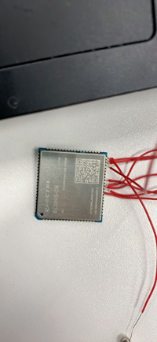              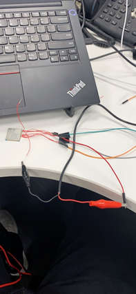

 POWKEY拉低开机后，未烧录固件的DM 


烧录后，重启的DM  


前后版本查询


### QuecPython MQTT连接异常处理

#### umqtt使用

umqtt模块提供创建MQTT客户端的发布订阅功能。该模块可以向服务端发布或者订阅消息，向服务器发送ping包,检测保持连通性，与服务器建立或者断开连接，需要注意的是MQTTClient.check_msg()和MQTTClient.wait_msg()方法中推荐使用**wait_msg**的方法。

#### 使用MQTT连接阿里云、腾讯云等

使用MQTT连接阿里云、腾讯云的步骤可以详细参见官网上的wiki社区（[https://python.quectel.com/wiki/](https://python.quectel.com/wiki/)）的QuecPython云服务。

#### 云服务运行demo出现，未订阅等信息

现象：类似下面截图

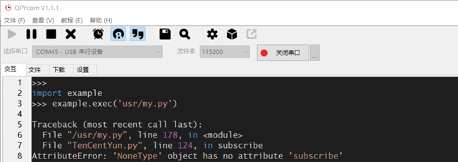                         

原因分析：（1）注网失败；（2）您订阅与发布的主题，在云服务端没有创建

（1）对于注网失败，解决步骤如下：

​		使用QCOM，连接AT口，查询命令“AT+CSQ; +CREG?; +CEREG? ;+CGREG? ; +CPIN?;+COPS?”，如下截图，类似下面情况说明您的网络状态是正常的。

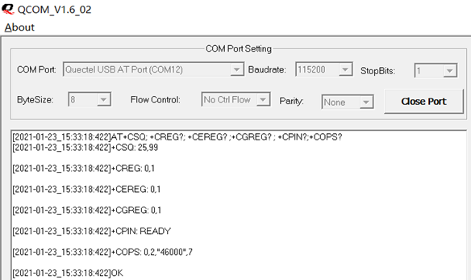

​		如有异常的常见解决方案是：

对于AT+CPIN?的异常处理，检查SIM卡座硬件问题；

对于CREG，CGREG，CEREG的，建议检查手机卡是否存在欠费等情况，也就是确认手机卡是否正常

对于CSQ的话，检查周围环境，是否存在导致信号不好的干扰，建议室外测试，或者室内加天线。

（２）  对于“订阅与发布的主题，在云服务端没有创建”，建议检查以下两点：

检查您订阅的主题，在云服务上对应的主题是不是也是可订阅的状态

检查您发布的主题，在云服务上对应的主题是不是也是可发布的状态

#### MQTT连接一段时间异常断开

导致原因： MQTT服务端会有心跳检测机制，一段时间内设备与云端没有通信活动会主动断开连接

尝试解决方向：连接断开是依据配置mqtt时的超时值keepalive，在超出活动时间后会主动断开连接，我们可以根据设置keepalive活动时间使用定时器在活动时间超出前主动向云端发送ping包，服务端返回的数据包无需客户处理。


### MQTT测试

客户疑问：MQTT断线通过捕获异常获取，但是断线后，异常捕获不到

疑问解答：会抛出异常，umqtt已经做了处理，上层的try捕捉不到下面的异常，对于断线后会尝试重连，有log输出，不会直接抛出异常。下面是测试的部分LOG（之前一直收发，后面拔卡后尝试重连） 

具体的测试代码是：

```python
from umqtt import MQTTClient
import utime
import log
import checkNet

PROJECT_NAME = "QuecPython_MQTT_example"
PROJECT_VERSION = "1.0.0"

checknet = checkNet.CheckNetwork(PROJECT_NAME, PROJECT_VERSION)

# 设置日志输出级别
log.basicConfig(level=log.INFO)
mqtt_log = log.getLogger("MQTT")

state = 0
def sub_cb(topic, msg):
    global state
    mqtt_log.info("Subscribe Recv: Topic={},Msg={}".format(topic.decode(), msg.decode()))

if __name__ == '__main__':
    utime.sleep(5)
    checknet.poweron_print_once()
    checknet.wait_network_connected()
    c = MQTTClient("umqtt_client", "mq.tongxinmao.com", 18830)
    c.set_callback(sub_cb)
    c.connect()
    while True:
        c.subscribe(b"/public/TEST/quecpython")
        mqtt_log.info("Connected to mq.tongxinmao.com, subscribed to /public/TEST/quecpython topic")
        # 发布消息
        c.publish(b"/public/TEST/quecpython", b"my name is Quecpython!")
        mqtt_log.info("Publish topic: /public/TEST/quecpython, msg: my name is Quecpython")
        c.wait_msg()  # 阻塞函数，监听消息
        if state == 1:
            break
    c.disconnect()
```

## QuecPython其他常见问题第一部分

### 拿到开发板后不知道怎么使用

参考对应开发板的使用指导文档，下载地址：[https://python.quectel.com/download.html](https://python.quectel.com/download.html)。

### EC100Y开发板与EC100Y模组的串口位置

EC100Y开发板（小熊派）的串口位置如下图：

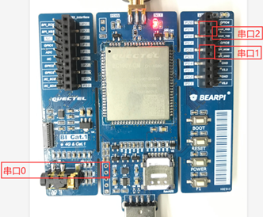

EC100Y模组的串口位置可参考《Quectel_EC100Y-CN_QuecOpen硬件设计手册V1.0》（可在移远QuecPython开发交流群的群文件自行下载）。

### EC600S开发板与EC600S模组的串口位置

EC600S开发板（EC600S_QuecPython_EVB_V1.x 开发板）的串口位置如下图：

 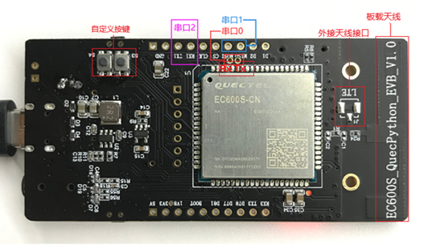

EC600S模组的串口位置可参考《Quectel_EC600S-CN_QuecOpen硬件设计手册V1.0.0_Preliminary_20200927》（可在移远QuecPython开发交流群的群文件自行下载）：

### Quecpython的GPIO对应关系说明

#### 对照原理图，在开发板找到具体位置

第一步，看这个GPIO与PIN脚的对应关系（位置在API库的PIN模块，左侧是QuecPython的GPIO命名，右侧是模组的PIN脚号），例如你想使用QuecPython的GPIO6，那么看了这个图，你知道的是GPIO6对应的是模组的PIN15；
 

第二步看，EC600SV1.1的原理图，（黑色部分无需关注，只需要关注红色圈的部分），对于刚刚说的QuecPython的GPIO6（PIN15）,这里关注的是PIN15对应的GPIO77（实际上GPIO77没有特别的含义，只是表示一个连接关系，也就是此处的GPIO77对应于下图中的GPIO77）。
 
 
 第三步，上方最后一个图的GPIO77，也就对应开发板引出的GPIO77(开发板的J6处)。
 总结：配置QuecPython的GPIO6，在开发板的GPIO77处查看配置是否生效。

#### 对照开发板丝印，找出对应的GPIO口

例如我想找开发板上的G81对应QuecPython的哪个GPIO口（如果按照下面方法没有找到对应的GPIO，那说明暂时还未开放）。

第一步，看原理图，开发板的G81对应原理图就是GPIO81。如下图所示，GPIO81对应的是PIN16（请忽略蓝色框的GPIO标识，记住PIN16）

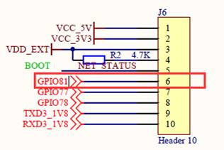 

第二步，看原理图，开发板的G81对应原理图就是GPIO81。如下图所示，GPIO81对应的是PIN16**（请忽略蓝色框的GPIO标识，记住PIN16）**

第三步，进入QuecPython的官网，找到PIN的API库（https://python.quectel.com/wiki/#/zh-cn/api/QuecPythonClasslib?id=pin）

如下图所示，**如果你要控制G81，就需要配置GPIO7**。

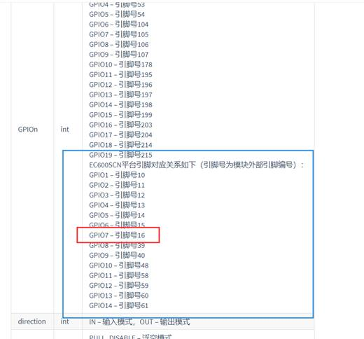

 

 

### usocket使用

usocket 模块提供对BSD套接字接口的访问，支持对socket的地址绑定、监听、连接、数据接收和发送等通信方法。详细可参见：QuecPython API类库文档usocket模块的使用。

代码示例：

```python
# 导入usocket模块
import usocket
import log

# 设置日志输出级别
log.basicConfig(level=log.INFO)
socket_log = log.getLogger("SOCKET")

# 创建一个socket实例
sock = usocket.socket(usocket.AF_INET, usocket.SOCK_STREAM)
# 解析域名
sockaddr = usocket.getaddrinfo('www.tongxinmao.com', 80)[0][-1]
# 建立连接
sock.connect(sockaddr)
# 向服务端发送消息
ret = sock.send('GET /News HTTP/1.1\r\nHost: www.tongxinmao.com\r\nAccept-Encoding: deflate\r\nConnection: keep-alive\r\n\r\n')
socket_log.info('send %d bytes' % ret)
# 接收服务端消息
data = sock.recv(256)
socket_log.info('recv %s bytes:' % len(data))
socket_log.info(data.decode())

# 关闭连接
sock.close()
```

运行结果示例：

 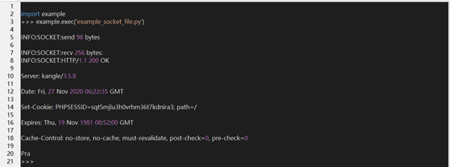

### QuecPython是否支持队列

​		队列是一种先进先出的数据结构，主要操作包括入队,出队。入队的元素加入到对尾，从队头取出出队的元素。在QuecPython中我们可以使用list操作来模拟队列：

```python
class queue:
    def __init__(self):
        self.__alist = []

    def push(self, value):
        self.__alist.insert(0, value)

    def pop(self):
        return self.__alist.pop()

    def size(self):
        return len(self.__alist)

    def clean(self):
        self.__alist.clear()

    def isEmpty(self):
        return self.__alist == []

    def showQueue(self):
        print(self.__alist)
```

运行：

```python
if __name__ == '__main__':
    q = queue()
    q.push(1)
    q.push("123")
    q.push("456")
    q.push(2)
    q.showQueue()
    print(q.pop())
    print(q.pop())
    print(q.pop())
    print(q.pop())
    q.showQueue()
```

### socket解析IP失败


使用socket、mqtt等相关网络连接的API时会出现IP解析失败导致出现上图异常。

定位问题方向：检查SIM卡是否注网成功以及检查该地址的有效性再次进行尝试。

查询驻网是否成功的AT指令，【**AT+cops?** 查询是否驻网】

### 执行脚本文件提示语法错误

 

导致原因：大概率是因为Python语法缩进错误（4个空格缩进）

排查方法：检查代码格式缩进是否规范

推荐使用：PyCharm或VsCode来进行开发，IDE会提示语法缩进与基本语法上的错误。

### SIM卡进行插拔后出现网络请求失败

因为目前EC100Y暂不支持SIM卡热插拔功能，所以如果我们的SIM卡在重新插拔后需要手动重启模块才能重新注网。

### QuecPython的源码文件安全吗

QPYcom下载工具有代码混淆加密功能，确保用户程序不被直接暴露。

### 在QPYcom操作没有任何反应

检查选择的串口是否正确并已打开。

### 开发板送的流量卡可以混用吗

机卡绑定，第一次开机注网就绑定。

### 编写python代码用什么工具

推荐使用pycharm或VScode，两款比较流行的IDE，自带自动补全功能。

### 板子接出的串口无法通信

要注意接口是1.8V还是3.3V，电平匹配才能正常通信。

### 接上USB线灯不亮

检查模块电压，保证模组的3.8V电压稳定，必要时用电池供电。

### 小熊派右上方的LED点亮代码

```python
>>> from machine import Pin
>>> gpio = Pin(Pin.GPIO15, Pin.OUT, Pin.PULL_DISABLE, 0)
>>> gpio.write(1)
0
>>> gpio.read()
1
```

### EC600S CNAA与CNLB的区别

CNAA是4G+2G，flash大一点，CNLB是4G，flash小一点

### apn_cfg.json里面是什么

内置的apn列表，不可删除

### 拖动文件到模组出现语法错误

请检查“.py”文件的语法问题（多数是缩进问题）

### 对Socket的[0] [-1]的解释

```python
>>> import usocket
>>> client = usocket.socket(usocket.AF_INET, usocket.SOCK_STREAM)
>>> sockaddr = usocket.getaddrinfo('www.tongxinmao.com',80)[0][-1]

>>> print(sockaddr)
('120.76.100.197', 80)
>>> sockaddr = usocket.getaddrinfo('www.tongxinmao.com',80)
>>> print(sockaddr)
[(2, 1, 0, 'www.tongxinmao.com', ('120.76.100.197', 80))]
```

举例说明：

```python
a = ((A,B,C),(2),(3))
a[0] = (A,B,C)
a[0][-1] = C
```

## QuecPython其他常见问题第二部分

### win7运行QPYcom出现“failed to execute script pyi_rth_multiprocessing”

故障现象：python通过pyinstaller打包后，在别的电脑运行失败“failed to execute script pyi_rth_multiprocessing”：在低版本windows7上运行会出现这个问题，在win10上面移植程序没问题。

故障分析：怀疑是windows某些dll文件版本过低，不支持高版本生成的exe，最简单的方法是：在win7机器上单独打个exe，然后在win7运行，移植。

建议客户的方法是：升级win7版本到sp1

### net.nitzTime()的获取

成功附着网络之后，基站下发一次（仅此一次）

### 对于EC600SV1.1的QuecPython板子，测试TTS功能注意事项

外设是接的喇叭，但是在TTS中配置的是“话筒”

由于V1.1上面加了一个功放，此时需要拉高模组（硬件拉高）socket的pin58（功放的使能脚），或者指令使能“audio_EN = Pin(Pin.GPIO11, Pin.OUT, Pin.PULL_PD, 1)”

外接的喇叭是功率是有限制的，建议小于8R 2W

### 如果需要AT配置的话，

**at+qaudmod=0 //spk**

**at+qaudmod=1 //hs**

**at+qaudmod=2 //loudspeaker**

下面需要后面加以理解

AT+QAUDPATH=0

AT+QAUDDCH=0

### 对于多.py文件的调用

对于usr目录下的两个文件a.py和b.py，如果想再a.py中调用b.py的话：需要在a.py里面加上下面代码

```python
#方法1
from usr import b
#方法2
import sys
sys.path.append('/usr/')  # 进入usr目录下
import b
```

### 线程有个数限制？

最多16个

### 如何对文件系统进行操作

根目录/是不可读不可写的，/usr是用户区，/bak是备份区

### 串口一次最多可以接受多少字节？

实测接收2000字节也行；发送最大512，超过自动分包；socket、MQTT收发2000字节也行

### Socket、MQTT、串口的数据监听会不会阻塞其他线程

Socket、MQTT本身是‘阻塞函数’，不会阻塞其他线程。

串口本身是‘非阻塞函数’，不会阻塞其他线程。

### 基站定位返回的参数解释

```python
>>> cellLocator.getLocation("www.queclocator.com", 80, "1111111122222222", 8, 1) 
(117.1138, 31.82279, 550) 
```

返回的550结果是什么意思

定位精度，单位m

### QuecPython队列的深度有最大值吗？比如一直发生回调，会不会丢失？

随内存自动增长

### 模块的Pin有没有默认电平的说明文档

我们开放出来IO目前是 默认输出低电平

### EC600S的模块RTC时间怎么样断电续航

断电没有办法续航，因为引出RTC

 

 

 